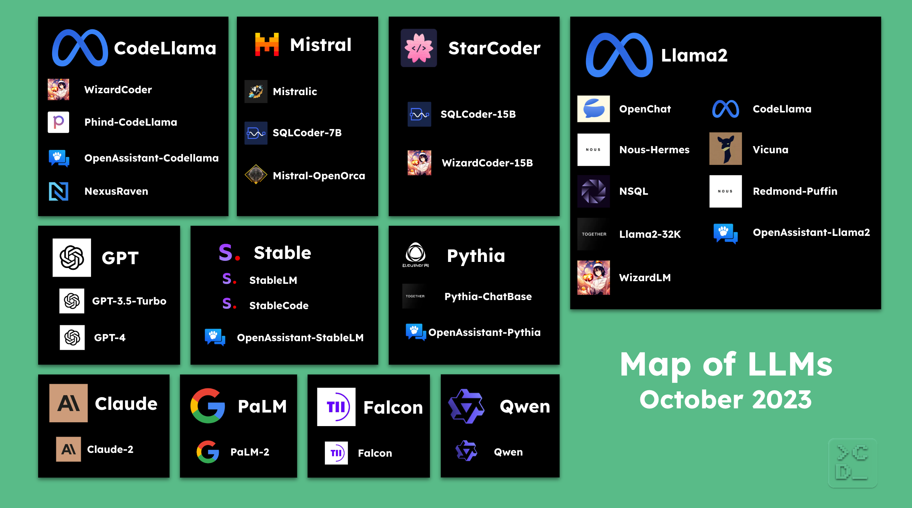

# What LLM to use? A perspective from the DevAI space

With how fast things are moving in the DevAI space, a shorthand for the community of developers building software with the help of large language models (LLMs), it can be challenging to figure out which model to use.

We started this repository based on our experiences as part of the [Continue community](https://github.com/continuedev/continue). Feel free to suggest improvements and help us keep it up-to-date by opening a pull request!

## What LLMs are there?

There are A LOT of LLMs. We’ve decided to focus on the ones that we see folks using now:

You can find a CSV that includes all of these models and information about them [here](./LLMs.csv).

## What LLMs are being used while coding?

### How do folks decide?

The first choice you typically make is whether you are going to use an **open-source** or a **commercial** model:

- You usually select an **open-source** LLM when you want to keep your code within your environment, have enough available memory, want to keep your costs low, or want to be able to manage and optimize everything end-to-end.
- You usually select a **commercial** LLM when you want the best model, prefer an easy and reliable setup, don’t have a lot of available memory, don’t mind your code leaving your environment, or are not deterred by cost concerns.

If you decide to use an **open-source** LLM, your next decision is whether to set up the model on your local machine or on a hosted model provider:

- You usually opt to use an open-source LLM on your _local machine_ when you have enough available memory, want free usage, or want to be able to use the model without needing an Internet connection.
- You usually opt to use an open-source LLM on a _hosted provider_ when you want the best open-source model, don’t have a lot of available memory on your local machine, or want the model to serve multiple people.

We maintain a guide on how to deploy an open-source code LLM for your team [here](https://github.com/continuedev/deploy-os-code-llm).

If you decide to use a **commercial** LLM, you'll typically obtain API keys and play with multiple of them for comparison. Both the quality of the suggestions and the cost to use can be important criteria.

### Open Source

This is a list of the **open-source** LLMs that developers are using while coding, roughly ordered from most popular to least popular, as of October 2023.

#### 1. Code Llama

[Code Llama](https://about.fb.com/news/2023/08/code-llama-ai-for-coding/) is an LLM trained by Meta for generating and discussing code. It is built on top of Llama 2. Even though it is below WizardCoder and Phind-CodeLlama on the [Big Code Models Leaderboard](https://huggingface.co/spaces/bigcode/bigcode-models-leaderboard), it is the base model for both of them. It also comes in a variety of sizes: 7B, 13B, and 34B, which makes it popular to use on local machines as well as with hosted providers. At this point, it is the most well-known open-source base model for coding and is leading the open-source effort to create coding capable LLMs.

    
Details

    Creator: Meta
    Date released: August 24th, 2023
    License: Llama 2 Community
    Base model: Llama 2
    Parameters: 7B, 13B, 34B

#### 2. WizardCoder

[WizardCoder](https://github.com/nlpxucan/WizardLM/tree/main/WizardCoder) is an LLM built on top of Code Llama by the WizardLM team. The [Evol-Instruct method](https://x.com/WizardLM_AI/status/1705551243421090207?s=20) is adapted for coding tasks to create a training dataset, which is used to fine-tune Code Llama. It comes in the same sizes as Code Llama: 7B, 13B, and 34B. As a result, it is the most popular open-source instruction-tuned LLM so far.

    
Details

    
    Creator: WizardLM
    Date released: August 26th, 2023
    License: Llama 2 Community
    Base model: Code Llama
    Parameters: 7B, 13B, 34B
    

#### 3. Phind-CodeLlama

[Phind-CodeLlama](https://www.phind.com/blog/code-llama-beats-gpt4) is an LLM built on top of Code Llama by Phind. A proprietary dataset of ~80k high-quality programming problems and solutions was used to fine-tune Code Llama. That fine-tuned model was then further fine-tuned on 1.5B additional tokens. It currently leads on the [Big Code Models Leaderboard](https://huggingface.co/spaces/bigcode/bigcode-models-leaderboard). However, it is only available as a 34B parameter model, so it requires more available memory to be used.

    
Details

    
    Creator: Phind
    Date released: August 28th, 2023
    License: Llama 2 Community
    Base model: Code Llama
    Parameters: 34B

#### 4. Mistral

[Mistral](https://mistral.ai/news/announcing-mistral-7b) is a 7B parameter LLM trained by Mistal AI. It is the most recently released model on this list, having dropped at the end of September. Mistal AI says that it “approaches CodeLlama 7B performance on code, while remaining good at English tasks”. Despite only being available in the one small size, people are quite excited about it in the first couple weeks after release. The first fine-tuned LLMs that use it as their base are now beginning to emerge, and we are likely to see more going forward.

    
Details

    
    Creator: Mistral AI
    Date released: September 27th, 2023
    License: Apache 2.0
    Base model: Mistral
    Parameters: 7B
    

#### 5. StarCoder

[StarCoder](https://huggingface.co/blog/starcoder) is a 15B parameter LLM trained by BigCode, which was ahead of its time when it was released in May. It was trained on 80+ programming languages from The Stack (v1.2) with opt-out requests excluded. It is not an instruction model and commands like "Write a function that computes the square root" do not work well. However, by using the [Tech Assistant prompt](https://huggingface.co/datasets/bigcode/ta-prompt) you can make it more helpful.

    
Details

    
    Creator: BigCode
    Date released: May 4th, 2023
    License: OpenRAIL-M
    Base model: StarCoder
    Parameters: 15B
    

#### 6. DeepSeek Coder

[DeepSeek Coder](https://deepseekcoder.github.io) is an LLM trained by DeepSeek AI on 2 trillion tokens. With a dataset made up of over more than 80 programming languages, it's the newest model on this list and has been reported to score quite high on various coding-related benchmarks.

    
Details

    
    Creator: DeepSeek AI
    Date released: November 3rd, 2023
    License: DeepSeek License Agreement
    Base model: DeepSeek Coder
    Parameters: 1.3B, 6.7B, 33B
    

#### 7. Llama2

[Llama 2](https://ai.meta.com/llama/#inside-the-model) is an LLM trained by Meta on 2 trillion tokens. It is the most popular open source LLM overall, so some developers use it, despite it not being as good as many of the models above at making code edits. It is also important because Code Llama, the most popular LLM for coding, is built on top of it, which in turn is the foundation for WizardCoder and Phind-CodeLlama.

    
Details

    
    Creator: Meta
    Date released: July 18th, 2023
    License: Llama 2 Community
    Base model: Llama 2
    Parameters: 7B, 13B, 70B
    

### Commercial

This is a list of the **commercial** LLMs that developers are using while coding, roughly ordered from most popular to least popular, as of October 2023.

#### 1. GPT-4

[GPT-4](https://openai.com/research/gpt-4) from OpenAI is generally considered to be the best LLM to use while coding. It is quite helpful when generating and discussing code. However, it requires you to send your code to OpenAI via their API and can be quite expensive. Nevertheless, it is the most popular LLM for coding overall and the majority of developers use it while coding at this point. All OpenAI API users who made a successful payment of $1 or more before July 6, 2023 were given access to GPT-4, and they plan to open up access to all developers soon.

#### 2. GPT-4 Turbo

[GPT-4 Turbo](https://openai.com/blog/new-models-and-developer-products-announced-at-devday) from OpenAI is cheaper and faster than GPT-4. It has knowledge cutoff of April 2023 and has a 128k context window. It is currently in preview, as of November 2023, but anyone with an OpenAI API account and existing GPT-4 access can use it.

#### 3. GPT-3.5 Turbo

[GPT-3.5 Turbo](https://platform.openai.com/docs/models/gpt-3-5) from OpenAI is cheaper and faster than GPT-4; however, its suggestions are not nearly as helpful. It also requires you to send your code to OpenAI via their API. It is the second most popular LLM for coding overall so far. All developers can use it now after signing up for an OpenAI account.

#### 4. Claude 2

[Claude 2](https://www.anthropic.com/index/claude-2) is an LLM trained by Anthropic, which has greatly improved coding skills compared to the first version of Claude. It especially excels, relative to other LLMs, when you provide a lot of context. It requires you to send your code to Anthropic via their API. You must apply to get access to Claude 2 at this point.

#### 5. PaLM 2

[PaLM 2](https://ai.google/discover/palm2) is an LLM trained by Google. To try it out, you must send your code to Google via the PaLM API after obtaining an API key via MakerSuite, both of which are currently in public preview.

## Contributing

If you see a model missing or want to share an opinion, we welcome you to open a PR or an issue! We hope to maintain a community-driven and up-to-date index of the most helpful language models for coding.

*If you liked this blog post and want to read more about DevAI–the community of folks building software with the help of LLMs–in the future, join our monthly newsletter [here](https://continue.dev#newsletter).*
